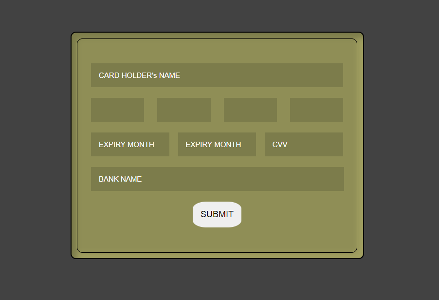

# Dhwani_RIS_Frontend_Task

### Task One

> Design A fully functional credit card input field component.

## Tech/framework

[][webdevplaylist]
[][webdevplaylist]
[][cssplaylist]
[][jsplaylist]
[][reactplaylist]
[][webdevplaylist]

[webdevplaylist]: #
[jsplaylist]: #
[cssplaylist]: #
[reactplaylist]: #

 

## Features

- [x] User will be able to paste not more than 16 digit number.
- [x] On pasting from the clipboard, the last input field will be in focused.
- [x] After adding 4 digits the focus will automatically move to the next input box.
- [x] The input field is keyboard accessible.
- [x] On pressing enter or submit card number will be displayed in a list with a delete option.

## Screenshots

## Installation

> - Clone the repo

> `https://github.com/Tripathikritika/Dhwani_RIS_Frontend_Task.git`

> - Go to the Task One Folder

> `cd Task_One`

> - Install Packages

> ` npm install`

> - Start the folder

> `npm start`

### Task Two

> Using Html/CSS/JS, created 5 boxes.When a users click a box, the box should appear at the top of all the other boxes.

## Tech/framework

[][webdevplaylist]
[][webdevplaylist]
[][cssplaylist]
[][jsplaylist]
[][webdevplaylist]

[webdevplaylist]: #
[jsplaylist]: #
[cssplaylist]: #
[reactplaylist]: #

 

## Features

- [x] Toggling Effect.

## Screenshots

## Installation

> - Clone the repo

> `https://github.com/Tripathikritika/Dhwani_RIS_Frontend_Task.git`

> - Go to the Task One Folder

> `cd Task_Two`

> - Run the index.html in Live server or using local path

## Credits

`https://dhwaniris.in/`

`https://masaischool.com/`
